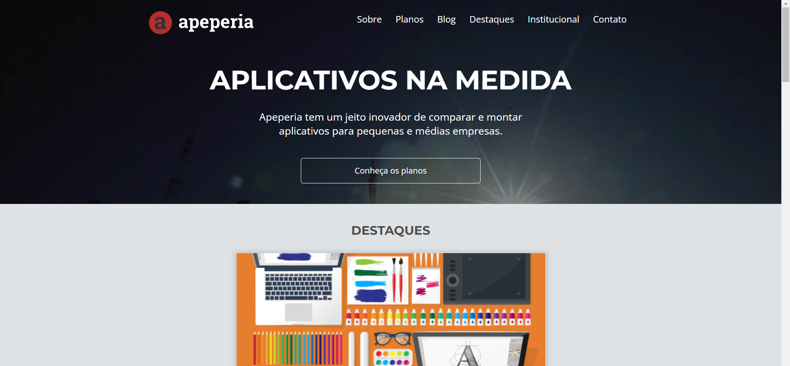

<h1 align="center"> Layout Responsivo - Alura</h1>

Projeto de Layout Responsivo pela Alura

---

 

  

---
## 💻 Tecnologias

Esse projeto foi desenvolvido com as seguintes tecnologias:

- HTML5
- CSS3
- Javascript
- Git e Github

---

## 🚧 Projeto

Este projeto foi desenvolvido durante o Curso Front End T5 One pela Alura, visando criar um layout responsivo para diversos tipos de Dispositivos Móveis, como: Celular, Tablet e Desktop.

Você pode ver o site neste link: [Projeto - Layout Responsivo Alura](https://nigerade.github.io/layoutResponsivo-Alura/)

--- 
